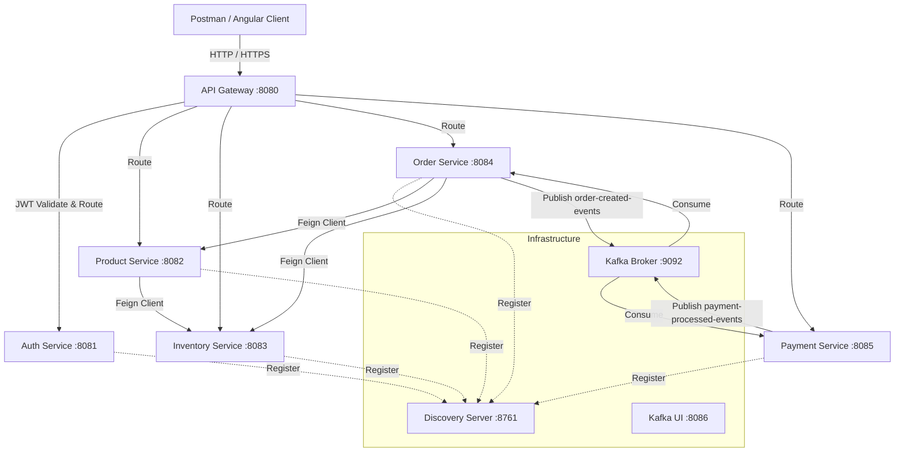

# Enterprise Order Management System (OMS)

A production-grade, highly scalable, and resilient **Microservices Architecture** built using **Spring Boot 3.2.0**, **Spring Cloud 2023.0.0**, **Java 17**, **Kafka**, **Docker**, **Angular 17**, and **PostgreSQL**. The system implements key enterprise design patterns including **Service Discovery (Eureka)**, **API Gateway Routing & JWT Security**, **Declarative REST (Feign Client)**, **Circuit Breaker & Retry (Resilience4j)**, **Database-per-Service**, and the **Saga Pattern (Choreography/Orchestration)** for distributed transaction rollback.

---

## 🏗️ System Architecture & Service Interlinking

The application consists of a decoupled network of specialized microservices communicating via both synchronous REST calls and asynchronous event streams:



### Core Service Definitions

1. **Discovery Server (Eureka)** (`:8761`): A centralized service registry. Every microservice registers itself with Eureka on startup, allowing them to dynamically locate each other without hardcoded URLs.
2. **API Gateway (Spring Cloud Gateway)** (`:8080`): The single entry point for all client requests. It validates stateless JWT tokens and routes requests dynamically to downstream services using Eureka load-balancing (`lb://`).
3. **Auth Service** (`:8081`): Manages authentication and user registration. Validates credentials against the PostgreSQL database (`authdb`) and issues secure JWT tokens.
4. **Product Service** (`:8082`): Manages the catalog of products stored in `productdb`. Uses a Feign Client to query the Inventory Service and retrieve real-time stock levels.
5. **Inventory Service** (`:8083`): Manages stock quantities in `inventorydb`. Handles queries for availability and handles reserving/releasing stock.
6. **Order Service** (`:8084`): Manages order records in `orderdb` and coordinates the order creation lifecycle. It acts as the Saga orchestrator, ensuring stock is reserved before payment is initiated.
7. **Payment Service** (`:8085`): Listens for order creation events from Kafka, processes mock transactions, updates `paymentdb`, and publishes completion events.

---

## ⚡ Is This a Real-Time (Production-Grade) Project?

**Yes.** This system is modeled after industry-standard designs used by companies like Uber, Netflix, and Walmart. It implements several patterns required for production deployments:

*   **Database-per-Service**: Each microservice has its own independent database schema. Services never access each other's databases directly, preventing tight database coupling.
*   **Saga Pattern (Eventual Consistency)**: Instead of locking databases across services (which causes performance bottlenecks), order processing is split into local transactions. If a step fails (e.g., payment is declined), the orchestrator triggers compensation actions (e.g., releasing reserved inventory) to rollback to a consistent state.
*   **Circuit Breakers & Retries (Resilience4j)**: Feign clients are configured with circuit breakers. If a dependent service is slow or down, the calling service trips the circuit and returns fallback data instantly, preventing cascading thread exhaustion and system crashes.
*   **Asynchronous Message Bus (Kafka)**: High-throughput event processing. Order statuses and payment records are communicated via non-blocking events, allowing services to scale independently.
*   **Centralized Configuration**: Spring Cloud Config server is initialized to support localized external configs, allowing runtime updates without rebuilding services.

---

## 🚀 How to Run the Project Simply Using Docker

> [!TIP]
> 📖 **Official Docker & Low-Storage Running Guide**: For day-to-day running, avoiding C: drive disk bloat, and automated Kafka event streaming details, see [`docker-running-guide.md`](file:///d:/enterprise-order-management-system/docker-running-guide.md).

All infrastructure (databases, Kafka, Eureka) and microservices are containerized. Follow these instructions to launch the entire stack:

### Prerequisites
*   [Java 17 JDK or higher](https://adoptium.net/) (for compiling the source code)
*   [Maven 3.8+](https://maven.apache.org/) (for packaging target files)
*   [Docker Desktop](https://www.docker.com/products/docker-desktop/) (running with Linux containers)

---

### Step 1: Package the Microservices
First, compile all Spring Boot modules and generate their executable JAR files. Go to the `backend` folder and run:
```bash
cd backend
mvn clean package -DskipTests
```
This produces `target/*.jar` files inside each microservice directory, which the Dockerfiles will package.

### Step 2: Start the System with Docker Compose
Navigate to the `docker` directory and launch all services:
```bash
cd ../docker
docker-compose up -d --build
```
This command builds the local Java container images and launches:
*   **5 PostgreSQL Databases** (`postgres-auth`, `postgres-product`, `postgres-inventory`, `postgres-order`, `postgres-payment`)
*   **Zookeeper & Apache Kafka** (for event messaging)
*   **Kafka UI** (for monitoring topics and offsets)
*   **Discovery Server (Eureka)**
*   **API Gateway**
*   **All Microservices** (Auth, Product, Inventory, Order, Payment)

### Step 3: Verify the Running Containers
Check that all containers are healthy:
```bash
docker ps
```
Or open **Discovery Server (Eureka Dashboard)** in your browser:
👉 [http://localhost:8761](http://localhost:8761)  
*All services (API-GATEWAY, AUTH-SERVICE, PRODUCT-SERVICE, etc.) should appear as registered and UP.*

---

## 📊 Access Dashboard URLs

| Service / Tool | URL | Port |
| :--- | :--- | :--- |
| **API Gateway (Router)** | `http://localhost:8080` | `8080` |
| **Eureka Server Dashboard** | [http://localhost:8761](http://localhost:8761) | `8761` |
| **Kafka UI Dashboard** | [http://localhost:8086](http://localhost:8086) | `8080 -> 8086` |
| **PostgreSQL (Auth DB)** | `localhost:5432` | `5432` |
| **PostgreSQL (Order DB)** | `localhost:5436` | `5436` |
| **PostgreSQL (Payment DB)** | `localhost:5437` | `5437` |
| **PostgreSQL (Product DB)** | `localhost:5434` | `5434` |
| **PostgreSQL (Inventory DB)** | `localhost:5435` | `5435` |

---

## 🧪 E2E Verification & Testing Flow

You can test the entire workflow sequentially (e.g. using Postman):

### 1. Register a New User
*   **POST** `http://localhost:8080/api/auth/register`
*   **Body**:
    ```json
    {
      "name": "John Doe",
      "email": "gateway@test.com",
      "password": "password123"
    }
    ```

### 2. Login to Obtain JWT Token
*   **POST** `http://localhost:8080/api/auth/login`
*   **Body**:
    ```json
    {
      "email": "gateway@test.com",
      "password": "password123"
    }
    ```
*   *Copy the `accessToken` from the response. Set this token as a `Bearer Token` in the Authorization header for all subsequent API requests.*

### 3. Create a Product
*   **POST** `http://localhost:8080/api/products`
*   **Headers**: `Authorization: Bearer <JWT_TOKEN>`
*   **Body**:
    ```json
    {
      "sku": "LAPTOP-002",
      "name": "Gaming Laptop",
      "description": "High performance gaming laptop",
      "price": 1599.99,
      "brand": "BrandTech",
      "category": "Electronics",
      "stockQuantity": 100,
      "createdBy": "gateway@test.com"
    }
    ```

### 4. Initialize Inventory Stock
*   **POST** `http://localhost:8080/api/inventory/initialize?sku=LAPTOP-002&quantity=50&location=WAREHOUSE_MAIN`
*   **Headers**: `Authorization: Bearer <JWT_TOKEN>`

### 5. Create an Order (Triggers Saga Flow)
*   **POST** `http://localhost:8080/api/orders`
*   **Headers**: `Authorization: Bearer <JWT_TOKEN>`
*   **Body**:
    ```json
    {
      "customerEmail": "test@example.com",
      "customerName": "Test User",
      "shippingAddress": "123 Main Street, Bangalore 560001",
      "items": [
        {
          "productSku": "LAPTOP-002",
          "quantity": 2
        }
      ]
    }
    ```
*   This triggers the orchestrator, reserving `2` laptops from the stock, sending the payment details, confirming the order, and publishing the `order-created-events` to Kafka.

### 6. Verify Kafka Messages via CLI
To confirm Kafka is publishing events, run:
```bash
docker exec kafka kafka-console-consumer --bootstrap-server localhost:9092 --topic order-created-events --from-beginning
```
You will see the JSON event representing the newly created order.

---

## 🎨 Frontend Setup (Angular App)

To run the Angular UI client locally:
1. Navigate to the `frontend` folder:
   ```bash
   cd frontend
   ```
2. Install npm dependencies:
   ```bash
   npm install
   ```
3. Start the Angular CLI development server (proxying requests to the API Gateway):
   ```bash
   npm start
   ```
4. Open your browser and navigate to `http://localhost:4200`.