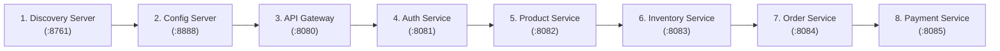

# Microservices Local Running & Testing Guide (Zero Docker)

This guide provides the exact steps to run and test your **Enterprise Order Management System** microservices locally on your Windows machine using your local PostgreSQL server with **zero Docker overhead**.

---

## 🛠️ Step 0: One-Time Local PostgreSQL Database Setup

Open **pgAdmin** (or `psql -U postgres`) and run the following commands to create the 5 databases:

```sql
CREATE DATABASE authdb;
CREATE DATABASE productdb;
CREATE DATABASE inventorydb;
CREATE DATABASE orderdb;
CREATE DATABASE paymentdb;
```

---

## 🚀 Step 1: Recommended Service Startup Sequence

Open separate PowerShell / Command Prompt terminal tabs and start the services in this order:



### Commands to Run Each Service:

#### Terminal 1: Discovery Server (Eureka Registry)
```powershell
cd d:\enterprise-order-management-system\backend\discovery-server
mvn spring-boot:run
```
* **Verify:** Open [http://localhost:8761](http://localhost:8761) in your browser. You should see the Eureka Dashboard.

---

#### Terminal 2: Config Server
```powershell
cd d:\enterprise-order-management-system\backend\config-server
mvn spring-boot:run
```
* **Verify:** Open [http://localhost:8888/order-service/default](http://localhost:8888/order-service/default) in your browser. You should see JSON configuration served from classpath.

---

#### Terminal 3: API Gateway
```powershell
cd d:\enterprise-order-management-system\backend\api-gateway
mvn spring-boot:run
```
* **Verify:** Gateway starts on port `8080` and registers with Eureka.

---

#### Terminal 4: Auth Service
```powershell
cd d:\enterprise-order-management-system\backend\auth-service
mvn spring-boot:run
```

---

#### Terminal 5: Product Service
```powershell
cd d:\enterprise-order-management-system\backend\product-service
mvn spring-boot:run
```

---

#### Terminal 6: Inventory Service
```powershell
cd d:\enterprise-order-management-system\backend\inventory-service
mvn spring-boot:run
```

---

#### Terminal 7: Order Service
```powershell
cd d:\enterprise-order-management-system\backend\order-service
mvn spring-boot:run
```

---

#### Terminal 8: Payment Service
```powershell
cd d:\enterprise-order-management-system\backend\payment-service
mvn spring-boot:run
```

---

## 🧪 Step 2: End-to-End API Testing via API Gateway (:8080)

All client requests go through **`http://localhost:8080`** (the single entry point).

### 1. Register a User (Auth Service)
```bash
curl -X POST http://localhost:8080/api/auth/register \
  -H "Content-Type: application/json" \
  -d '{
    "username": "john_doe",
    "email": "john@example.com",
    "password": "Password123!",
    "role": "USER"
  }'
```

---

### 2. Login to Get JWT Token
```bash
curl -X POST http://localhost:8080/api/auth/login \
  -H "Content-Type: application/json" \
  -d '{
    "username": "john_doe",
    "password": "Password123!"
  }'
```
* Copy the returned JWT token value: `"token": "eyJhbGciOi..."`

---

### 3. Create a Product (Product Service via Gateway)
```bash
curl -X POST http://localhost:8080/api/products \
  -H "Authorization: Bearer <YOUR_JWT_TOKEN>" \
  -H "Content-Type: application/json" \
  -d '{
    "name": "Apple iPhone 15 Pro",
    "description": "256GB Natural Titanium",
    "price": 999.99,
    "sku": "IPHONE_15_PRO"
  }'
```

---

### 4. Add Inventory Stock (Inventory Service via Gateway)
```bash
curl -X POST http://localhost:8080/api/inventory \
  -H "Authorization: Bearer <YOUR_JWT_TOKEN>" \
  -H "Content-Type: application/json" \
  -d '{
    "sku": "IPHONE_15_PRO",
    "quantity": 10
  }'
```

---

### 5. Place an Order (Order Service $\rightarrow$ OpenFeign to Inventory $\rightarrow$ Resilience4j)
```bash
curl -X POST http://localhost:8080/api/orders \
  -H "Authorization: Bearer <YOUR_JWT_TOKEN>" \
  -H "Content-Type: application/json" \
  -d '{
    "customerEmail": "john@example.com",
    "orderItems": [
      {
        "sku": "IPHONE_15_PRO",
        "quantity": 1,
        "price": 999.99
      }
    ]
  }'
```

---

## 🔍 Observing Microservices Patterns in Action

### 1. Distributed Tracing (`Trace ID` & `Span ID`)
Look at your PowerShell consoles for **`api-gateway`**, **`order-service`**, and **`inventory-service`**.
You will see correlated log lines with the **same Trace ID**:
```text
INFO [order-service,5a8f4c2e1b,7d3a1f9e0c] : Validating stock with Inventory Service...
INFO [inventory-service,5a8f4c2e1b,9e2f4a1c8b] : Stock verified for SKU: IPHONE_15_PRO
```

### 2. OpenFeign JWT Propagation
`FeignConfig` in `order-service` automatically extracts the incoming `Authorization: Bearer ...` token and attaches it to the outgoing HTTP call to `inventory-service`.

### 3. Resilience4j Circuit Breaker Test
1. Stop the **`inventory-service`** terminal (`Ctrl + C`).
2. Place another order via `POST http://localhost:8080/api/orders`.
3. Notice that `order-service` does NOT crash or hang indefinitely; it executes `InventoryClientFallback` gracefully and returns an informative fallback response!
### 6. Dynamic Config Refresh Test (@RefreshScope)

1. Start `config-server` on port `8888` and `order-service` on port `8084`.
2. Fetch the live configuration via `order-service`:
   ```bash
   curl -X GET http://localhost:8084/api/orders/config
   ```
   **Output:**
   ```json
   {
     "status": "SUCCESS",
     "message": "Live configuration fetched via Spring Cloud Config & @RefreshScope",
     "discountPercentage": 10,
     "defaultCurrency": "USD",
     "maxItemsPerOrder": 50,
     "enableAutoCancellation": true
   }
   ```
3. Modify `discount-percentage: 25` in `config-server/src/main/resources/config/order-service.yml`.
4. Trigger dynamic reload without restarting `order-service`:
   ```bash
   curl -X POST http://localhost:8084/actuator/refresh
   ```
5. Call `GET http://localhost:8084/api/orders/config` again:
   * Notice `discountPercentage` is immediately updated to **`25`** with zero downtime!

### 7. Spring Boot DevTools (Hot Restart)
Every microservice now includes `spring-boot-devtools`. Whenever you edit Java code or YAML files in your IDE and recompile/save, Spring Boot automatically restarts the application context in ~1 second without needing to restart the process!
